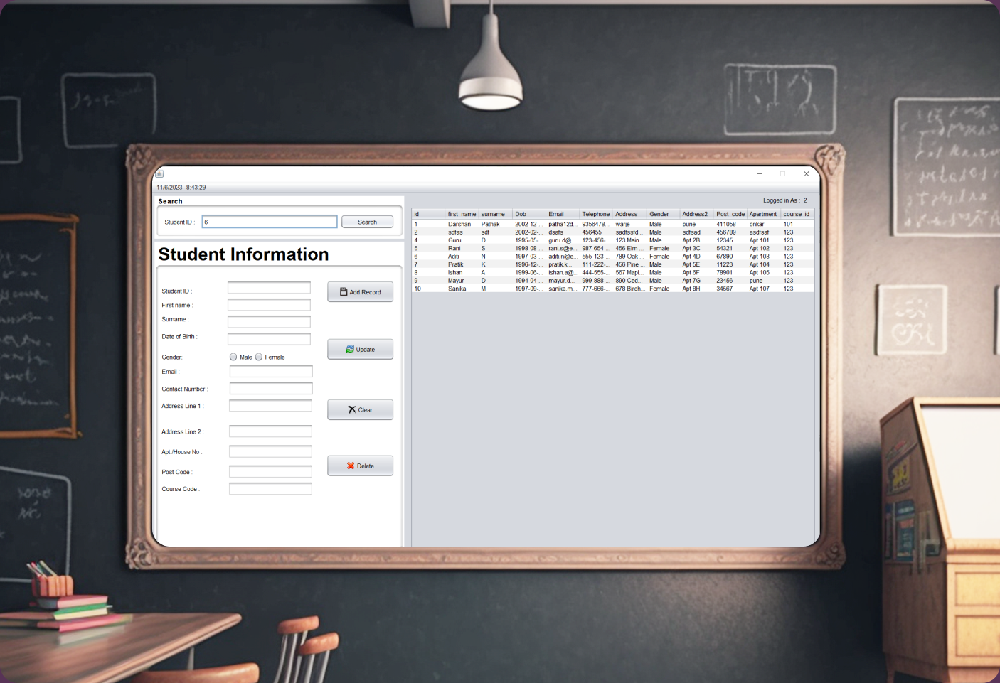

# Student Management System

<p align="center">
  
</p> 

## Overview

The Student Management System is a project designed to manage student information effectively. This system provides features for handling various aspects of student data, ensuring a seamless and organized way to manage educational records.


### Directories

- build Contains compiled classes and generated sources.
  - classes Stores compiled `.class` files.
    - studentinformationsystemimages Contains image resources for the system.
  - empty Placeholder directory.
  - generated-sources Contains generated source outputs.
    - ap-source-output Stores generated source files for annotation processing.
  
- dist Distribution directory containing packaged libraries.
  - lib Stores additional libraries required by the system.

- nbproject NetBeans project directory.
  - private Contains private configuration files.

- ScreenShots Stores screenshots of the application.

- src Source directory containing the main project code.
  - studentinformationsystemimages Source images for the system.

## Installation

1. Clone the Repository
   ```sh
   git clone https://github.com/Pathakdarshan12/Student_Management_System.git
   ```
2. Navigate to Project Directory
   ```sh
   cd Student_Management_System
   ```

## Usage

To run the project, ensure you have the necessary dependencies and a suitable development environment, such as NetBeans or any Java IDE. Compile and run the project through your IDE or via the command line.

## Dependencies

- Java Development Kit (JDK)
- Any necessary libraries mentioned in the `distlib` directory

## Screenshots

Screenshots of the application can be found in the `ScreenShots` directory.

## License

This project is licensed under the MIT License. See the [LICENSE](LICENSE) file for details.

## Acknowledgements

- Special thanks to the contributors and supporters of this project.
- Mention any resources or libraries that were particularly helpful.

---


## Contact
<p align="left">
<a href="https://www.linkedin.com/in/pathakdarshan12/" target="blank">
    
</a>
<a href="https://x.com/_Pathak_Darshan" target="blank">
    
</a>
<a href="https://www.instagram.com/pathakdarshan12/" target="blank">
    
</a>
<a href="mailto:pathakdarshan12@gmail.com" target="blank">
    
</a>
</p>

